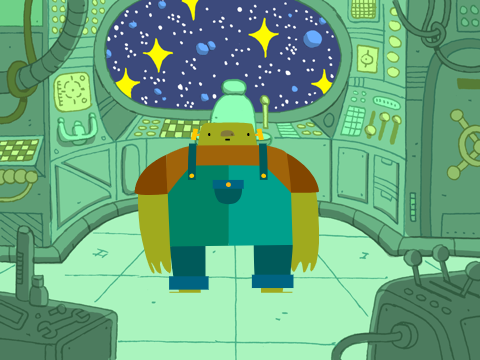
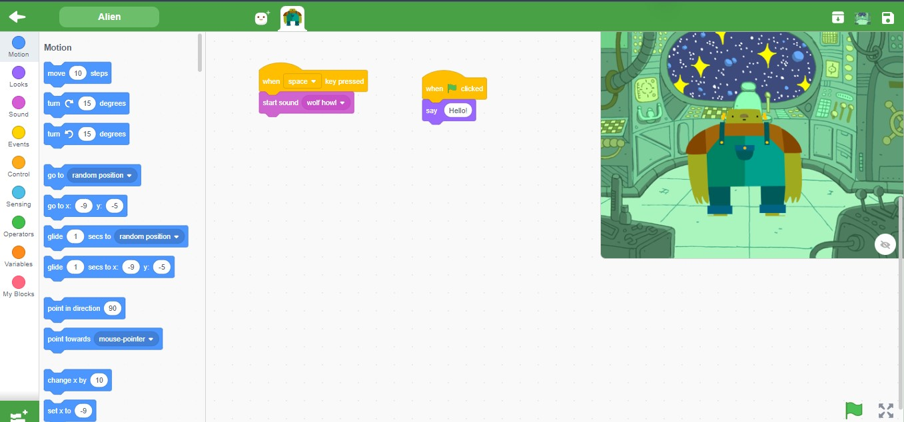

<h2>Screenshot</h2>

<h3>Blocks</h3>

<h3>Solution</h3>
<pre>
"solution": {
    "targets": [
      {
        "targetIndex": 0,
        "costumes": [
          {
            "name": "Spaceship"
          }
        ]
      },
      {
        "targetIndex": 1,
        "blocks": [
          {
            "opcode": "event_whenkeypressed",
            "topLevel":true,
            "fields": { "KEY_OPTION": ["*", null] }
          },
          {
            "opcode": "sound_play",
            "inputs": { "SOUND_MENU": [1, "*"] }
          },
          {
            "opcode": "sound_sounds_menu",
            "fields": { "SOUND_MENU": ["*", null] }
          },
          {
            "opcode": "event_whenflagclicked",
            "topLevel": true
          },
          {
            "opcode": "looks_say",
            "inputs": { "MESSAGE": [1, [10, "*"]] }
          }
        ]
      }
    ]
  }
</pre>