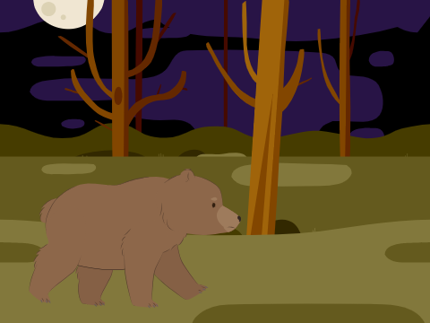
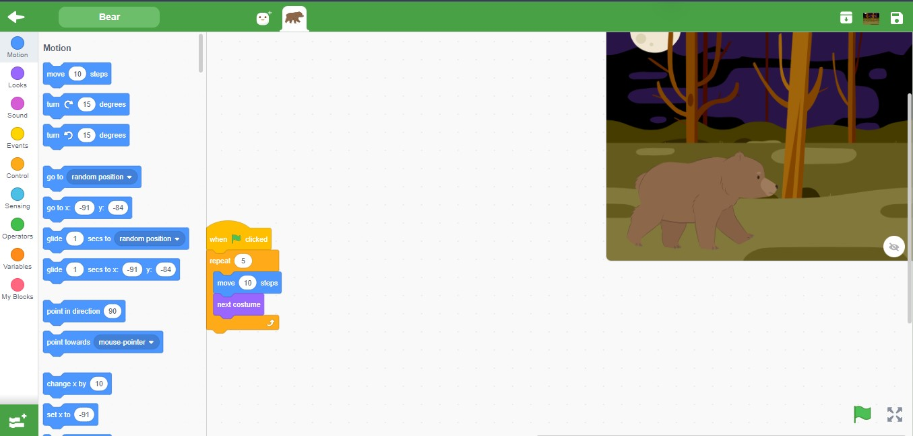

<h2>Screenshot</h2>

<h3>Blocks</h3>

<h3>Solution</h3>
<pre>
"solution": {
    "targets": [
      {
        "targetIndex": 0,
        "costumes": [
          {
            "name": "Woods"
          }
        ]
      },
      {
        "targetIndex": 1,
        "blocks": [
          {
            "opcode": "event_whenflagclicked",
            "topLevel":true
          },
          {
            "opcode": "control_repeat",
            "inputs": { "TIMES": [1, [6, "5"]], "SUBSTACK": [] }
          },
          {
            "opcode": "motion_movesteps",
            "inputs": { "STEPS": [1, [4, "10"]] }
          },
          {
            "opcode": "looks_nextcostume"
          }
        ]
      }
    ]
  }
</pre>