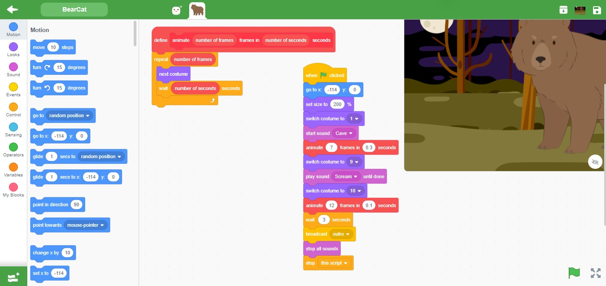

<h2>Screenshot</h2>

<h3>Blocks</h3>

<h3>Solution</h3>
<pre>
"solution": {
    "targets": [
      {
        "targetIndex": 0,
        "costumes": [
          {
            "name": "Woods"
          }
        ]
      },
      {
        "targetIndex": 1,
        "blocks": [
          {
            "opcode": "event_whenflagclicked",
            "topLevel": true
          },
          {
            "opcode": "motion_gotoxy",
            "inputs": { "X": [1, [4, "*"]], "Y": [1, [4, "*"]] }
          },
          {
            "opcode": "looks_setsizeto",
            "inputs": { "SIZE": [1, [4, "*"]] }
          },
          {
            "opcode": "looks_switchcostumeto",
            "inputs": { "COSTUME": [1, "*"] }
          },
          {
            "opcode": "looks_costume",
            "fields": { "COSTUME": ["*", null] }
          },
          {
            "opcode": "sound_play",
            "inputs": { "SOUND_MENU": [1, "*"] }
          },
          {
            "opcode": "sound_sounds_menu",
            "fields": { "SOUND_MENU": ["*", null] }
          },
          {
            "opcode": "procedures_call"
          },
          {
            "opcode": "looks_switchcostumeto",
            "inputs": { "COSTUME": [1, "*"] }
          },
          {
            "opcode": "looks_costume",
            "fields": { "COSTUME": ["*", null] }
          },
          {
            "opcode": "procedures_definition",
            "topLevel": true,
            "inputs": { "custom_block": [1, "*"] }
          },
          {
            "opcode": "procedures_prototype"
          },
          {
            "opcode": "control_repeat"
          },
          {
            "opcode": "argument_reporter_string_number",
            "fields": { "VALUE": ["*", null] }
          },
          {
            "opcode": "looks_nextcostume"
          },
          {
            "opcode": "control_wait",
            "inputs": { "DURATION": [3, "*", [5, "*"]] }
          },
          {
            "opcode": "argument_reporter_string_number",
            "fields": { "VALUE": ["*", null] }
          }
        ]
      }
    ]
  }
</pre>