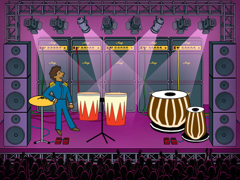
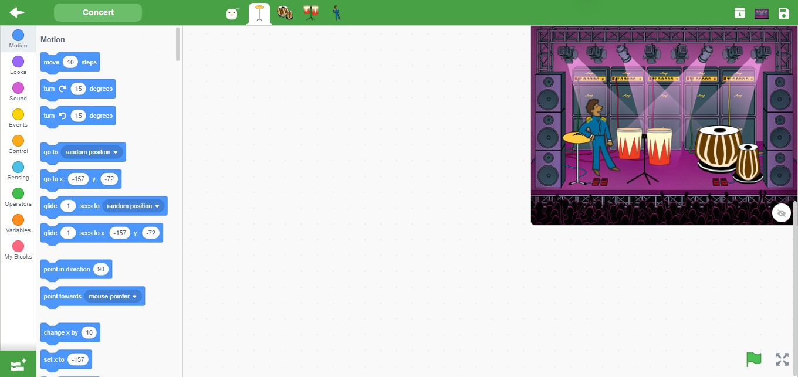

<h2>Screenshot</h2>

<h3>Blocks</h3>

<h3>Solution</h3>
<pre>
"solution": {
    "targets": [
      {
        "targetIndex": 0,
        "costumes": [
          {
            "name": "Concert"
          }
        ]
      },
      {
        "targetIndex": 1,
        "blocks": [],
        "name":"Drum-cymbal"
      },
      {
        "targetIndex": 2,
        "blocks": [],
        "name": "Drums Tabla"
      },
      {
        "targetIndex": 3,
        "blocks": [],
        "name": "Drums Conga"
      },
      {
        "targetIndex": 4,
        "blocks": [],
        "name": "Prince"
      }
    ]
  }
</pre>