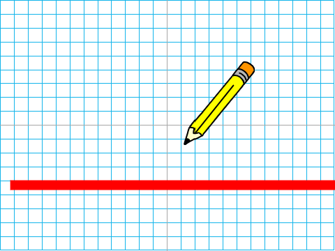
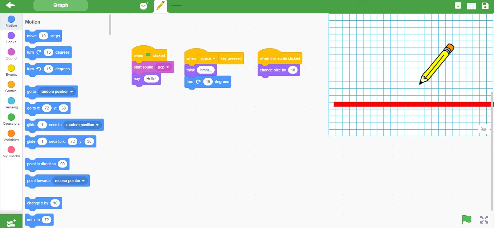

<h2>Screenshot</h2>

<h3>Blocks</h3>

<h3>Solution</h3>
<pre>
"solution": {
    "targets": [
      {
        "targetIndex": 0,
        "costumes": [
          {
            "name": "Xy-grid-20px"
          }
        ]
      },
      {
        "targetIndex": 1,
        "blocks": [
            {
               "opcode": "event_whenflagclicked",
                "topLevel": true
            },
            {
                "opcode": "sound_play",
                "inputs": { "SOUND_MENU": [1, "*"] }
            },
            {
                "opcode": "sound_sounds_menu",
                "fields": { "SOUND_MENU": ["*", null] }
            },
            {
                "opcode": "looks_say",
                "inputs": { "MESSAGE": [1, [10, "*"]] }
            },
            {
                "opcode": "event_whenkeypressed",
                "topLevel": true,
                "fields": { "KEY_OPTION": ["*", null] }
            },
            {
                "opcode": "looks_think",
                "inputs": { "MESSAGE": [1, [10, "*"]] }
            },
            {
                "opcode": "motion_turnright",
                "inputs": { "DEGREES": [1, [4, "*"]] }
            },
            {
                "opcode": "event_whenthisspriteclicked",
                "topLevel": true
            },
            {
                "opcode": "looks_changesizeby",
                "inputs": { "CHANGE": [1, [4, "*"]] }
            }
        ]
      }
    ]
  },
</pre>