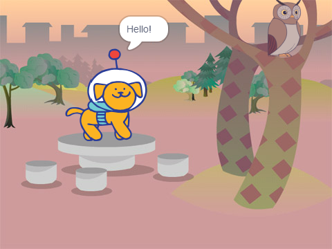
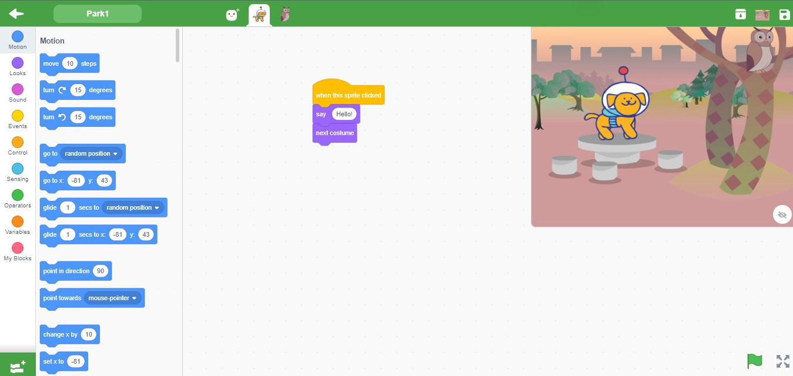

<h2>Screenshot</h2>

<h3>Blocks</h3>

<h3>Solution</h3>
<pre>
"solution": {
    "targets": [
      {
        "targetIndex": 0,
        "costumes": [
          {
            "name": "Woods And Bench"
          }
        ]
      },
      {
        "targetIndex": 1,
        "blocks": [
          {
            "opcode": "event_whenthisspriteclicked",
            "topLevel": true
          },
          {
            "opcode": "looks_say",
            "inputs": { "MESSAGE": [1, [10, "*"]] }
          },
          {
            "opcode": "looks_nextcostume"
          }
        ]
      },
      {
         "targetIndex": 2,
         "blocks":[],
         "name": "Owl"
      }
    ]
  }
</pre>