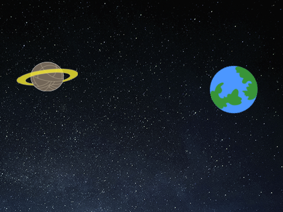
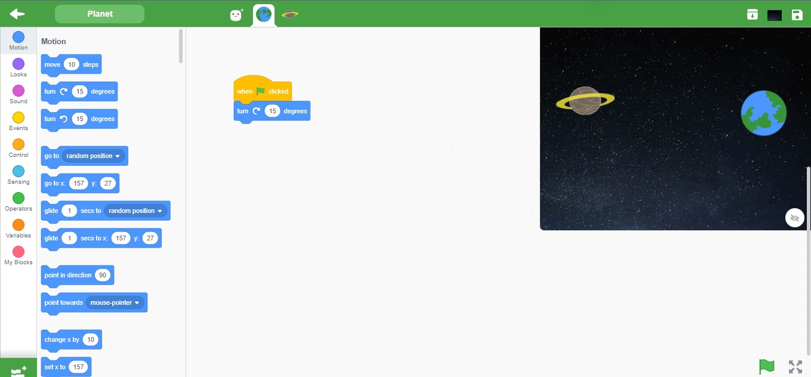
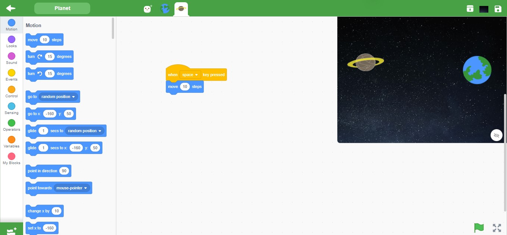

<h2>Screenshot</h2>

<h3>Blocks</h3>

<h3>Solution</h3>
<pre>
"solution": {
    "targets": [
      {
        "targetIndex": 0,
        "costumes": [
          {
            "name": "Stars"
          }
        ]
      },
      {
        "targetIndex": 1,
        "blocks": [
          {
            "opcode": "event_whenflagclicked",
            "topLevel": true
          },
          {
            "opcode": "motion_turnright",
            "inputs": { "DEGREES": [1, [4, "*"]] }
          }
        ]
      },
      {
        "targetIndex": 2,
        "blocks": [
            {
              "opcode": "event_whenkeypressed",
              "topLevel": true
            },
            {
              "opcode": "motion_movesteps",
              "inputs": { "STEPS": [1, [4, "*"]] }
            }
        ]
      }
    ]
  }
</pre>